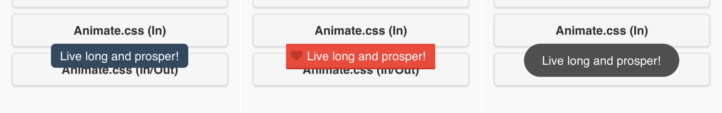

[](http://gruntjs.com/)

# jquery.mobile.toast

> A jQuery Mobile Android-like Toast Plugin.




## Getting started

Download the [production version][min] or the [development version][max].

[min]: https://raw.github.com/TobiasHennig/jquery-mobile-toast/master/dist/jquery.mobile.toast.min.js
[max]: https://raw.github.com/TobiasHennig/jquery-mobile-toast/master/dist/jquery.mobile.toast.js

### Usage

In your web page:

```html
<script src="jquery.js"></script>
<script src="jquery.mobile.js"></script>
<script src="jquery.mobile.toast.js"></script>
<script>
$.mobile.toast({
    message: 'Live long and prosper!'
});
</script>
```

## Requirements

* [jQuery](http://jquery.com/)
* [jQuery Mobile](http://jquerymobile.com/)

### Optional requirements

* [Animate.cc](http://daneden.me/animate/)

## Development

Run `npm install` to install dependencies. Run `grunt` to minify, test and generate documentation.

## Options

### message

Type: `String`  
Default: ``

The message of the toast.

**Example:**

```javascript
$.mobile.toast({ message: 'Live long and prosper' });

// Change default value
$.mobile.toast.prototype.options.message = 'Live long and prosper';
```

### duration

Type: `Number or String`  
Default: `2000`

Duration of message show to the user.

**Example:**

```javascript
$.mobile.toast({
    message: 'Live long and prosper',
    duration: 2000
});

// Change default value
$.mobile.toast.prototype.options.duration = 2000;
```

### classOnOpen

Type: `String`  
Default: `""`

Optional class to overwrite styling of toast on open.

**Example:**

```javascript
$.mobile.toast({
    message: 'Live long and prosper',
    classOnOpen: 'pomegranate'
});

// Change default value
$.mobile.toast.prototype.options.classOnOpen = 'pomegranate';
```

### classOnClose

Type: `String`  
Default: `""`

Optional class to overwrite styling of toast on close.

**Example:**

```javascript
$.mobile.toast({
    message: 'Live long and prosper',
    classOnClose: 'pomegranate'
});

// Change default value
$.mobile.toast.prototype.options.classOnClose = 'pomegranate';
```

## Examples

### Example 1: Default
Default toast.

Javascript:
```javascript
$.mobile.toast({
    message: 'Live long and prosper!'
});
```

### Example 2: Looong toast
Toast with a 3000ms duration, default is 2000ms.

Javascript:
```javascript
$.mobile.toast({
    message: 'Live long and prosper!',
    duration: 'long'
});
```

### Example 3: Custom toast
Toast with additional class to customize.

CSS:
```css
.pomegranate {
    /* OVERWRITES */
    background-color:      #E74C3C !important;
    -webkit-border-radius: 2px !important;
            border-radius: 2px !important;

    /* CUSTOM */
    box-shadow: 0 2px #C0392B;
}
.pomegranate p {
    /* OVERWRITES */
    /*max-width:  160px    !important;*/
    /*margin:     0        !important;*/
    /*padding:    6px 12px !important;*/
    padding-left: 28px     !important;

    /*font-size:  14px     !important;*/
    /*color:      #FFFFFF  !important;*/
    /*text-shadow:none     !important;*/

    /*border:     none     !important;*/

    /* CUSTOM */
    background-image: url('heart.png');
    background-repeat: no-repeat;
    background-position: 6px 8px;
    background-size: 16px;
}
```

Javascript:
```javascript
$.mobile.toast({
    message: 'Live long and prosper!',
    classOnOpen: 'pomegranate'
});
```

### Example 4: Events
Javascript:
```javascript
$.mobile.toast({
    message: 'Live long and prosper!',
    afterclose: function( event, ui ){
        alert('Toast closed!');
    }
});
```

### Example 5: Custom start animation
Javascript:
```javascript
$.mobile.toast({
    message: 'Live long and prosper!',
    classOnOpen: 'animated bounceInUp'
});
```

### Example 6: Custom start/end animation


Javascript:
```javascript
$.mobile.toast({
    message: 'Live long and prosper!',
    classOnOpen: 'animated slideInLeft',
    classOnClose: 'slideOutRight'
});
```

## Release History

#### 0.0.6 (2014-08-30)
* option `duration` with text version "short" (2000 ms) or "long" (3500ms)

#### 0.0.5 (2014-03-17)
* base widget ($.mobile.widget) removed, deprecated as of jQuery Mobile 1.4 and will be removed in 1.5
* update demo to jQuery Mobile 1.4
* add new custom theme "KitKat"

#### 0.0.4 (2013-10-02)
* increase font size
* update demo to jQuery Mobile 1.4.0 beta.1
* Tests added

#### 0.0.3